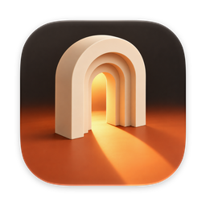

  

<h1 align="center">Akari</h1>

  A calmer web browser for Mac and Windows, by <a href="https://0arch.io">0ARCH</a>. 
  <a href="https://0arch.io/akari">0arch.io/akari</a> ·
  <a href="https://akari-sync.nexcore-ms.workers.dev/changelog">What's new</a>

  <a href="https://github.com/0arch-io/akari-releases/releases/download/v0.3.0/Akari-0.3.0.dmg"><b>Download for Mac</b></a>
  &nbsp;·&nbsp;
  <a href="https://github.com/0arch-io/akari-releases/releases/download/v0.3.0/Akari-Setup-0.3.0.exe"><b>Download for Windows</b></a>

  

Your tabs live in a sidebar that tucks away, your favorites sit in a grid, and one color sets the mood for the whole window. Akari is built on Chromium, so websites and Chrome Web Store extensions work the same as in Chrome.

This repository holds Akari's public downloads. Akari is an early preview: free, and expect rough edges.

## What makes it different

- Tabs in a sidebar that hides away and slides back when you point at the left edge.
- Favorites as a grid of icons: drag a tab up to keep it, drag it back down to let it go.
- Tab groups you can name, color and fold away.
- Nine colors, including a true black, that paint the whole window.
- The address bar sits in the sidebar, or on top if you prefer.
- Sign in with your email and your favorites and color follow you to your other computers, Mac and Windows alike. The synced data is encrypted on your computer; the server can't read it.
- Akari updates itself. When a new version is ready, click **Restart to update** in the sidebar, and a short "What's new" card shows what changed.

## Requirements

| | |
|---|---|
| Mac | Apple silicon (M1 or newer), macOS 13 or later |
| Windows | 64-bit, Windows 10 or 11 |
| Download | About 190 MB on Mac, 175 MB on Windows |
| Price | Free |

## Install

**Mac**

1. Download `Akari-0.3.0.dmg` and open it.
2. Drag Akari onto the Applications folder next to it.
3. Open Akari from Applications. It's signed and notarized by Apple, so it opens without warnings.

**Windows**

1. Download `Akari-Setup-0.3.0.exe` and run it.
2. The installer isn't code-signed yet, so Windows may say it protected your PC. Click **More info**, then **Run anyway**.
3. Akari installs for your user only, with no admin prompt, and opens when it's done.

Already on Akari 0.2.0 for Mac? Download 0.3.0 once. From then on Akari keeps itself up to date.

## Where the preview is rough

- Passkeys saved in iCloud Keychain don't show up on the Mac yet. When a site asks, pick the phone option and scan the code with your iPhone.
- The Windows installer isn't code-signed yet (see the install steps above).
- An iPhone version is planned but not here yet.

## Credits

Akari is built on [Chromium](https://www.chromium.org), the open source project behind Google Chrome, copyright The Chromium Authors and used under its BSD-style license. Open `chrome://credits` in Akari for every open source component and its license.
